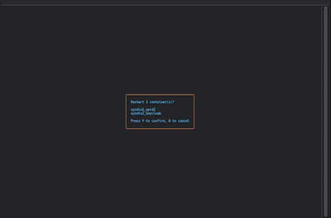

# Docker TUI

A modern, fast Terminal User Interface (TUI) for managing Docker containers, built with Go and Bubbletea.


## Features

- 🐳 Container management (start/stop/restart/pause/remove)
- 📋 Real-time log streaming with regex filtering
- 📊 CPU monitoring per container
- 🖱️ Mouse and keyboard support
- 🤖 MCP server for Claude Desktop integration
- 💾 Single binary, no dependencies



## Installation

### Via go install

```bash
go install github.com/eviltik/docker-tui@latest
```

### From GitHub Releases

Download pre-built binaries from the [releases page](https://github.com/eviltik/docker-tui/releases):

```bash
# Linux (amd64)
curl -L https://github.com/eviltik/docker-tui/releases/latest/download/docker-tui-linux-amd64.tar.gz | tar xz
sudo mv docker-tui /usr/local/bin/

# macOS (Apple Silicon)
curl -L https://github.com/eviltik/docker-tui/releases/latest/download/docker-tui-darwin-arm64.tar.gz | tar xz
sudo mv docker-tui /usr/local/bin/
```

### From Source

```bash
# Clone the repository
git clone https://github.com/eviltik/docker-tui.git
cd docker-tui

# Build the binary
make build

# Install system-wide (optional)
sudo make install
```

## Usage

Simply run the binary:

```bash
./docker-tui
```

Or if installed system-wide:

```bash
docker-tui
```

### Command Line Options

```bash
docker-tui [OPTIONS]
```

Options:
- `--demo` - Hide container name prefixes (removes text up to first underscore) - useful for presentations
- `--debug-monitor` - Show debug metrics (goroutines, file descriptors, memory, active streams)
- `--logs-buffer-length SIZE` - Maximum log lines in buffer (default: 10000, minimum: 100)
- `--mcp-server` - Enable MCP HTTP server alongside TUI (default port: 9876)
- `--mcp-port PORT` - Set MCP server port (default: 9876)
- `--help`, `-h` - Show help message with all options and keyboard shortcuts

Examples:
```bash
docker-tui                                    # Run in normal mode
docker-tui --demo                             # Run in demo mode (clean container names)
docker-tui --debug-monitor                    # Run with debug metrics displayed
docker-tui --logs-buffer-length 50000         # Use 50k lines buffer for logs
docker-tui --mcp-server                       # Run with MCP server on port 9876
docker-tui --mcp-server --mcp-port 9000       # Run with MCP server on custom port
docker-tui --help                             # Show help
```

### Keyboard Shortcuts

#### Container List View

| Key | Action |
|-----|--------|
| `↑/↓` | Navigate up/down |
| `PgUp/PgDown` | Jump by 10 items |
| `Home/End` | Jump to first/last |
| `SPACE` | Toggle selection |
| `Shift+↑/↓` | Range selection |
| `A` | Select all containers |
| `Ctrl+A` | Select all running containers |
| `X` | Clear selection |
| `I` | Invert selection |
| `ENTER` or `L` | Show logs for selected container(s) |
| `S` | Start selected container(s) |
| `K` | Kill (stop) selected container(s) |
| `R` | Restart selected container(s) |
| `P` | Pause/Unpause selected container(s) |
| `D` | Remove selected container(s) |
| `/` | Filter containers (regex support) |
| `M` | Show MCP server logs (when `--mcp-server` is active) |
| `Q/ESC` | Quit (with confirmation) or clear filter |
| `Ctrl+C` | Quit immediately |

#### Log View

| Key | Action |
|-----|--------|
| `↑/↓` | Scroll logs line by line |
| `PgUp/PgDown` | Page up/down |
| `Home/End` | Jump to top/bottom |
| `ENTER` | Insert timestamp mark |
| `C` | Toggle colored backgrounds on/off |
| `/` | Filter logs (substring search) |
| `Q/ESC` | Return to container list or clear filter |

#### Confirmation Dialog

| Key | Action |
|-----|--------|
| `Y` | Confirm action |
| `N` or `Q/ESC` | Cancel |

### Mouse Support

| Action | Effect |
|--------|--------|
| **Left Click** | Move cursor and toggle selection |
| **Double Click** | Show logs for clicked container |
| **Mouse Wheel Up/Down** | Scroll through container list |

## Features in Detail

### Multi-Container Selection

- Use `SPACE` to toggle individual containers
- Use `Shift+↑/↓` for range selection
- Click with mouse to select containers
- Selected containers are marked with a yellow `✓`
- Actions apply to all selected containers

### Mouse Interaction

- **Single Click**: Move cursor to container and toggle selection
- **Double Click**: Instantly show logs for the clicked container
- **Mouse Wheel**: Scroll up/down through the container list
- Works seamlessly alongside keyboard shortcuts

### Log Streaming

- View logs from multiple containers simultaneously
- Each log line shows container name with colored background for easy identification
- Toggle colored backgrounds on/off with `C` key (useful for copying logs)
- Container names are aligned for better readability
- Logs auto-scroll if you're at the bottom
- Press `ENTER` to insert a timestamp mark
- Automatic reconnection if container restarts
- Real-time filtering with substring search (`/` key)

### Filtering

**Container List Filtering:**
- Press `/` to enter filter mode
- Supports regex patterns (case-insensitive)
- Invalid regex patterns are highlighted in red
- Press `ENTER` to apply filter or `ESC` to cancel
- Filter is shown in the title bar with a 🔍 icon
- Hidden container count is displayed in stats

**Log Filtering:**
- Press `/` to enter filter mode
- Uses case-insensitive substring search
- Filtering happens in real-time as you type
- Filter applies to log content (ANSI codes are stripped for accurate matching)
- Press `Q` or `ESC` to clear filter

### Container Actions

All actions support both single and multi-container operations:

- **Start**: Start stopped containers
- **Stop**: Gracefully stop running containers (10s timeout)
- **Restart**: Restart containers (10s timeout)
- **Pause/Unpause**: Smart toggle - pauses running containers, unpauses paused ones
- **Remove**: Force remove containers (with confirmation)

Multi-container operations (>1 selected) show a confirmation dialog with the list of affected containers.

### Crash Logging

All panics are automatically captured and logged to `/tmp/docker-tui-crash.log` with:
- Full stack traces for the crashing goroutine and all other goroutines
- System metrics (goroutines, file descriptors, memory, GC stats)
- Goroutine name identification for easier debugging
- Timestamp and error details

If Docker TUI crashes, check the crash log for detailed diagnostics:

```bash
cat /tmp/docker-tui-crash.log
```

### Configurable Log Buffer

Customize the log buffer size with `--logs-buffer-length`:

```bash
docker-tui --logs-buffer-length 50000  # 50k lines buffer
docker-tui --logs-buffer-length 1000   # 1k lines buffer (low memory)
```

Default: 10,000 lines. Minimum: 100 lines.

Larger buffers allow viewing more historical logs but consume more memory. Adjust based on your needs and available resources.

## MCP Server (Model Context Protocol)

Docker TUI includes a built-in MCP HTTP server that exposes Docker container management capabilities to AI assistants like Claude Code. The server runs alongside the TUI (or in HTTP-only mode without TTY) and provides programmatic access to container operations and logs.

### Features

- **HTTP Transport**: JSON-RPC 2.0 over HTTP with Server-Sent Events (SSE) support
- **Stateless Mode**: Each request is independent, no session management required
- **6 Powerful Tools**: Complete container lifecycle management
- **Real-time Log Streaming**: Shared LogBroker architecture for efficient log access
- **Auto-refresh**: Container list updates every 5 seconds
- **CORS Enabled**: Works with web-based AI assistants
- **High Performance**: CPU stats cached for instant responses (~6ms for list_containers)

### Available Tools

1. **list_containers** - List all Docker containers with status and resource usage
   - Filter by state (running/stopped/all)
   - Filter by name (case-insensitive substring)
   - Returns: container ID, name, state, status, CPU%, log rate, ports

2. **get_logs** - Fetch container logs with advanced filtering
   - Support for regex or substring filtering
   - Configurable line limit (default: 100, max: 10000)
   - Automatic ANSI code stripping for accurate filtering
   - Returns: formatted logs with container name prefix

3. **get_stats** - Get detailed resource statistics
   - Real-time CPU usage percentage
   - Optional 10-value CPU history
   - Log rate (lines/second)
   - Current status and ports

4. **start_container** - Start stopped containers
   - Supports partial name matching
   - Batch operations on multiple containers
   - Returns: success/failure status per container

5. **stop_container** - Stop running containers
   - 10-second graceful timeout
   - Batch operations support
   - Returns: success/failure status per container

6. **restart_container** - Restart containers
   - 10-second timeout
   - Works on any container state
   - Returns: success/failure status per container

### Installation with Claude Code

#### Method 1: Command Line (Recommended)

```bash
# Start the MCP server
docker-tui --mcp-server --mcp-port 9876 &

# Add to Claude Code
claude mcp add-json docker-tui '{
  "type": "http",
  "url": "http://localhost:9876/mcp"
}'
```

#### Method 2: Configuration File

Add to your `~/.claude.json`:

```json
{
  "mcpServers": {
    "docker-tui": {
      "type": "http",
      "url": "http://localhost:9876/mcp"
    }
  }
}
```

Then start the server:

```bash
docker-tui --mcp-server --mcp-port 9876
```

#### Method 3: Project-level Configuration

Create `.mcp.json` in your project:

```json
{
  "mcpServers": {
    "docker-tui": {
      "type": "http",
      "url": "http://localhost:9876/mcp"
    }
  }
}
```

### Testing the MCP Server

Once installed, you can test each tool with Claude Code. Here are example prompts:

#### 1. List Containers

```
Show me all my running Docker containers
```

```
List all containers including stopped ones
```

```
Find containers with "nginx" in their name
```

#### 2. Get Logs

```
Show me the last 50 lines of logs from my nginx container
```

```
Get logs from redis container and filter for errors
```

```
Show me logs from all containers matching "api" with lines containing "WARNING"
```

```
Get the last 10 lines from mongodb container using regex filter for "connection.*failed"
```

#### 3. Get Statistics

```
What's the CPU usage of my running containers?
```

```
Show me detailed stats with CPU history for the postgres container
```

```
Get resource usage for all containers matching "web"
```

#### 4. Start Containers

```
Start the nginx container
```

```
Start all containers with "test" in their name
```

#### 5. Stop Containers

```
Stop the redis container gracefully
```

```
Stop all containers matching "dev"
```

#### 6. Restart Containers

```
Restart the mongodb container
```

```
Restart all api containers
```

#### Advanced Multi-Tool Workflows

```
List all running containers, then show me logs from the one using the most CPU
```

```
Find containers with "staging" in the name, get their stats, and restart any that are using more than 80% CPU
```

```
Show me all stopped containers, then start the ones that contain "service" in their name
```

### HTTP-Only Mode

When running in an environment without a TTY (like Docker or systemd), the server automatically runs in HTTP-only mode:

```bash
# In a Docker container or background service
docker-tui --mcp-server --mcp-port 9876
# Output: Running in HTTP-only mode (no TTY detected)
```

### Architecture

- **Transport**: StreamableHTTPServerTransport from [go-mcp](https://github.com/ThinkInAIXYZ/go-mcp)
- **Protocol**: JSON-RPC 2.0 with SSE support
- **Log Streaming**: Shared LogBroker instance with the TUI
- **CPU Stats Cache**: Shared cache updated every 5 seconds for instant MCP responses
- **Auto-discovery**: Container list refreshes every 5 seconds
- **Graceful Shutdown**: Proper cleanup on SIGINT/SIGTERM

## Development

### Prerequisites

- Go 1.24 or higher
- Docker installed and running
- Access to Docker socket (`/var/run/docker.sock`)

### Building

```bash
# Build for current platform
make build

# Run without building
make run

# Build for all platforms
make dist-all

# Clean build artifacts
make clean

# Run tests
make test

# Format code
make fmt
```

## Troubleshooting

### Permission Denied

If you get "permission denied" accessing Docker socket:

```bash
# Add your user to docker group
sudo usermod -aG docker $USER

# Or run with sudo (not recommended)
sudo ./docker-tui
```

### Docker Not Running

Make sure Docker daemon is running:

```bash
# Check Docker status
systemctl status docker

# Start Docker
sudo systemctl start docker
```

## Contributing

Contributions are welcome! Please feel free to submit a Pull Request or suggest improvement by opening a ticket.

## License

MIT License - see [LICENSE](LICENSE) file for details

## Author

eviltik

## Acknowledgments

- [Bubbletea](https://github.com/charmbracelet/bubbletea) - Excellent TUI framework
- [Lipgloss](https://github.com/charmbracelet/lipgloss) - Beautiful terminal styling
- [Docker](https://www.docker.com/) - Container platform
- [Claude Code](https://claude.com/claude-code) - AI-powered development assistance
